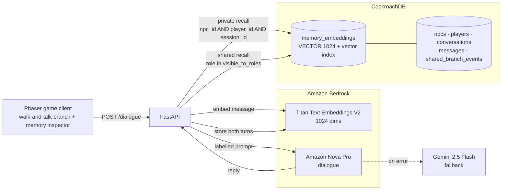

<div align="center">

# OmniNPC

### Role-aware semantic memory for AI characters

*Rishi Chhabra · Aryan Kandari*


</div>

---

An agent that remembers everything it was ever told is not a memory system — it's a leak
waiting for the right question.

OmniNPC gives each character its own memory and enforces who may recall what **in the
database query**, not in the prompt. A private conversation with the branch manager stays
private. The decision that came out of it can be published to the roles that need it. The
teller can retrieve neither.

## Why this is hard

Most character systems either forget earlier interactions or pour all history into one
shared context. A shared context makes it trivial for a character to reveal something it
should never have received, and asking the model nicely not to mention it is not an access
control boundary.

OmniNPC applies the visibility rule during retrieval, not during generation:

| Mechanism | Rule |
|---|---|
| **Private memories** | Carry an NPC id, a player id, and a session id. Recall requires all three to match — there is no database path from one character to another's rows, or from one play session into another's. |
| **Shared branch events** | Have no NPC owner. Their audience is derived **server-side** from the event type, and matched against the requesting character's role — callers name an event, they never choose who sees it. |
| **Provenance labeling** | The prompt separates what a character personally remembers from official branch bulletins, so retrieved facts carry the right authority. |
| **Per-session isolation** | Memory is tagged with a per-session id; a new tab or reload begins from empty, and closing the tab tears that session's rows down. Same isolation query that separates characters also separates sessions — one `WHERE` clause. |

This design keeps another NPC's private rows out of the recall context. It does not
attempt to treat model instructions as an access-control boundary.

## Scenario guides

The game client ships six scripted scenarios along the top bar. Each opens an explainer —
the situation, what it proves, and the CockroachDB capability it showcases — then walks the
player over and plays out one turn per click so the memory inspector can be watched filling
in. Four are everyday branch situations, two are deliberately strange stress tests.

| Scenario | Character | Showcases |
|---|---|---|
| Persuasion Attack | Manager | Vector-indexed private recall — his own accumulating record of your attempts holds the line |
| Smurfing the Deposit | Teller | Private rows vs. a role-scoped suspicion event — visibility is a `WHERE role IN (…)` predicate |
| Inconsistent Applicant | Loan officer | Semantic recall catches a self-contradicting income figure across turns |
| Privacy Probe | Manager → Teller | Cross-character isolation: the teller has no database path to the manager's private rows |
| Phantom Promise | Teller | Per-session collections: a promise from another session isn't in this collection, so nothing is confirmed |
| Reckless Windfall | Wealth advisor | Recall bridges a stated risk tolerance to a later reckless ask that shares no keywords |

See [docs/SCENARIO.md](docs/SCENARIO.md) for the full end-to-end scenario writeup and
implementation status of every stage.

## Architecture



A dialogue request:

1. Embed the player's message with Titan.
2. Retrieve private memories for this character, this player, and this session, above a
   similarity floor.
3. Retrieve shared events whose audience includes this character's role.
4. Compose a prompt that labels the two kinds separately.
5. Generate the reply with Nova — if the call fails, fall back to Gemini so the scenario
   keeps running, logging which provider actually answered.
6. Store both sides of the exchange as private memories for that character.

Structured records and 1024-dimensional memory vectors live in the same CockroachDB
cluster, so a visibility rule is a `WHERE` clause rather than a sync job between a database
and a separate vector store.

## Cast and endpoints

Seven characters ship by default: two tellers, a manager, a loan officer, a compliance
officer, a wealth advisor, and a guard. `GET /npcs` returns the roster.

| Endpoint | Purpose |
|---|---|
| `POST /dialogue` | Send a player message to a character, get a reply |
| `GET /npcs` | List the seeded characters |
| `GET /npcs/players` | List active players |
| `POST /world/authorize` | Record an authorization decision as a shared branch event |
| `GET /world/events/{player_id}` | Read shared events visible for a player |
| `DELETE /world/events/{event_id}` | Remove a shared event |
| `DELETE /world/reset` | Wipe all memory and events, keep branch/staff/customers |
| `DELETE /world/session/{session_id}` | Tear down one session's memory |
| `POST /world/session/sweep` | Clean up stale sessions |

## Quickstart

```bash
# 1. Provision CockroachDB
brew install cockroachdb/tap/ccloud libpq
ccloud auth login
export CRDB_SQL_PASSWORD='your-sql-password'
./scripts/bootstrap.sh

# 2. Configure and run the backend
cp backend/.env.example backend/.env   # fill in COCKROACHDB_URL + AWS credentials
cd backend
python -m venv .venv && source .venv/bin/activate
pip install -r requirements.txt
uvicorn app.main:app --reload --port 8000

# 3. Run the game
cd ../game
npm install
npm run dev   # http://localhost:3001
```

Walk with arrows/WASD, press **E** near a character to talk, **Esc** to leave a
conversation. **Clear DB** wipes all memory and events but keeps the branch, staff, and
customers.

Full setup, Docker instructions, and troubleshooting (including the CockroachDB CA cert
mount issue) are in [INSTALL.md](INSTALL.md). Verify an end-to-end install with:

```bash
python scripts/verify.py
```

This runs the isolation test suite against the live backend — private memories don't cross
characters, shared events reach only the roles in their audience.

## Hackathon tool mapping

Built for the [CockroachDB × AWS Hackathon — Build with Agentic Memory](https://cockroachdb-ai.devpost.com/).

| Tool | Used for | Where |
|---|---|---|
| CockroachDB Distributed Vector Indexing | `VECTOR(1024)` column and vector index over all character memory; similarity recall, scoped by npc, player, and session in the same query | `schema/init.sql`, `backend/app/memory/retrieval.py` |
| CockroachDB ccloud CLI | Provisioning the `omninpc` database and deriving the connection string, so no host is hardcoded | `scripts/bootstrap.sh` |
| CockroachDB Cloud Managed MCP Server | Read-only auditing of stored memory and branch events. Configured; authentication not yet completed | `.mcp.json` |
| Amazon Bedrock — Titan Text Embeddings V2 | Every memory vector, at 1024 dimensions | `backend/app/providers/bedrock.py`, `backend/app/embeddings.py` |
| Amazon Bedrock — Amazon Nova Pro | Character dialogue, via the Converse API | `backend/app/providers/bedrock.py` |

The cluster runs on AWS `us-east-1`, the same region as the Bedrock calls.

## License

[MIT](LICENSE)
