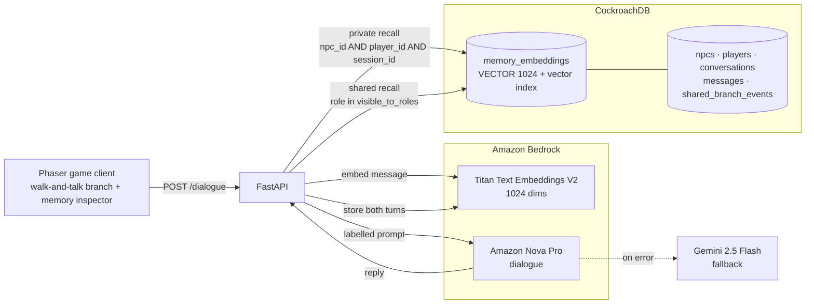

<div align="center">

# OmniNPC

### Role-aware semantic memory for AI characters

*Rishi Chhabra · Aryan Kandari*


</div>

---

## Overview

An NPC ("non-player character") is any character in a game that the computer controls
instead of a human player, like a shopkeeper or a bank teller you can walk up to and talk
to. In OmniNPC, each NPC is backed by an AI model instead of pre-written dialogue: type
something to a character, that text goes to an AI, and the AI writes back what the
character says. OmniNPC's job is to give every character its own memory and enforce, at
the database level, who is allowed to know what.

## The problem

For an AI character to hold a real conversation, it needs to remember what was said
earlier. The easy way to build that is to keep one shared pile of every conversation, with
every character, and feed relevant pieces of it back to whichever character is talking at
the moment.

That easy way has a hole in it. Say you tell the bank manager something private, off the
record, maybe that you're trying to talk your way into the vault, or you let slip that
you're splitting up cash deposits to stay under a reporting threshold. Later you walk over
to the teller and ask her something that happens to be related. If the system searches
"everything anyone has ever said" for relevant context, it can hand the teller's AI your
private conversation with the manager, and now the teller can act on something she was
never supposed to know. Nobody wrote code to leak it. Nothing was written to stop it,
either.

The only thing keeping that from happening, in a naive setup, is an instruction typed
into the AI's prompt, something like "don't share private information." That is not a
security boundary, it's a suggestion, and people are good at talking language models out
of following suggestions, the same way chatbot jailbreaks work. The information is sitting
there, retrievable, and it only takes someone asking the right question to surface it.

## The solution

OmniNPC doesn't ask the AI to police itself. It stops the leak one layer down, in the
database, before the AI ever sees anything it shouldn't.

Every memory gets stored with three tags: which character heard it, which player said it,
and which play session it happened in. When the teller is about to respond to you, the
system only fetches memory rows tagged "teller, this player, this session." Your
conversation with the manager is tagged "manager," so that query cannot return it, in the
same way a database query for one customer's orders cannot accidentally return another
customer's. The AI generating the teller's reply never receives the manager's data in the
first place, so there is nothing in its context for a clever prompt to extract.

That covers character-to-character privacy. Two more pieces round it out:

- **Shared branch events.** Some information genuinely should reach more than one
  character, for example a suspicious-activity flag that both the teller and the
  compliance officer should know about. These events aren't private to any one character.
  Instead, the server decides which job roles can see each event type, and a character
  only receives events that match its own role. A caller can report "a customer looked
  suspicious," but it cannot decide who gets told; that's fixed on the server so a
  compromised or confused caller can't widen who sees it.
- **Session isolation.** Every browser tab or reload gets its own session id, and memory
  is tagged with it too. Open a new tab and every character starts with a clean slate,
  as if they'd never met you. Close the tab and that session's memories are deleted. This
  uses the exact same kind of database filter as character privacy: one more tag, one more
  condition on the query.

None of this depends on the AI behaving itself. It depends on the database only ever being
asked for rows that are actually allowed to be seen, which is a much easier thing to get
right than asking a language model to keep a secret under pressure.

**Example.** You corner the manager and say something you'd only say in private. That
message and his reply are stored as memory tagged character = manager, player = you,
session = this session. You leave, walk to the teller's window, and ask something related.
The teller's AI queries for memory tagged character = teller, player = you, session = this
session; your conversation with the manager doesn't match any of those tags, so it's
excluded before retrieval even happens, not filtered out afterward. If the manager's
conversation triggered a shared event, like flagging suspicious behavior, that event is
separately visible to whichever roles are supposed to see it, regardless of who's in the
room, so the teller might see "this customer was flagged" without ever seeing why, in your
private words, if her role isn't on that event's audience list.

## Scenario guides

The included game client ships six scripted scenarios along the top bar, each demonstrating
one piece of this. Each opens an explainer, the situation, what it proves, and the
CockroachDB feature behind it, then walks you through it one turn at a time so you can
watch the memory inspector fill in live.

| Scenario | Character | What it proves |
|---|---|---|
| Persuasion Attack | Manager | His own accumulating memory of your attempts holds the line, retrieved by semantic similarity, not keyword matching |
| Smurfing the Deposit | Teller | A private conversation stays private, while a role-scoped suspicion event still reaches the right people |
| Inconsistent Applicant | Loan officer | Semantic recall catches you contradicting an earlier stated income figure |
| Privacy Probe | Manager to teller | The teller's database query has no path to the manager's private rows, at all |
| Phantom Promise | Teller | A promise made in a different session doesn't exist in this one, so nothing is confirmed |
| Reckless Windfall | Wealth advisor | Recall connects a stated risk tolerance to a later reckless request, even with no shared keywords |

See [docs/SCENARIO.md](docs/SCENARIO.md) for the full scenario writeup and the
implementation status of each stage.

## Architecture



What happens on one message, step by step:

1. Your message is converted to a vector (a list of numbers representing its meaning) by
   Titan, an embedding model.
2. The database is queried for that character's private memories with you, in this
   session, that are similar enough in meaning to matter.
3. The database is queried again for shared events whose audience list includes that
   character's role.
4. Both results go into the prompt, clearly labeled: this part is what the character
   personally remembers, this part is an official bulletin.
5. Nova, the dialogue model, generates the reply. If that call fails, Gemini answers
   instead, so a demo doesn't die mid-conversation, and which provider actually answered
   gets logged.
6. Both sides of the exchange are stored as new memories for that character.

Structured data (who's who, what happened) and the memory vectors live in the same
CockroachDB cluster, so a privacy rule is one `WHERE` clause, not a separate sync job
between a database and a standalone vector store.

## Cast and endpoints

Seven characters ship by default: two tellers, a manager, a loan officer, a compliance
officer, a wealth advisor, and a guard. `GET /npcs` returns the roster.

| Endpoint | Purpose |
|---|---|
| `POST /dialogue` | Send a player message to a character, get a reply |
| `GET /npcs` | List the seeded characters |
| `GET /npcs/players` | List active players |
| `POST /world/authorize` | Record an authorization decision as a shared branch event |
| `GET /world/events/{player_id}` | Read shared events visible for a player |
| `DELETE /world/events/{event_id}` | Remove a shared event |
| `DELETE /world/reset` | Wipe all memory and events, keep branch/staff/customers |
| `DELETE /world/session/{session_id}` | Tear down one session's memory |
| `POST /world/session/sweep` | Clean up stale sessions |

## Getting started

```bash
# 1. Provision CockroachDB
brew install cockroachdb/tap/ccloud libpq
ccloud auth login
export CRDB_SQL_PASSWORD='your-sql-password'
./scripts/bootstrap.sh

# 2. Configure and run the backend
cp backend/.env.example backend/.env   # fill in COCKROACHDB_URL + AWS credentials
cd backend
python -m venv .venv && source .venv/bin/activate
pip install -r requirements.txt
uvicorn app.main:app --reload --port 8000

# 3. Run the game
cd ../game
npm install
npm run dev   # http://localhost:3001
```

Walk with arrows or WASD, press **E** near a character to talk, **Esc** to leave a
conversation. **Clear DB** wipes all memory and events but keeps the branch, staff, and
customers.

Full setup, Docker instructions, and troubleshooting (including a CockroachDB CA cert
mount issue) are in [INSTALL.md](INSTALL.md). Verify an end-to-end install with:

```bash
python scripts/verify.py
```

This runs the isolation test suite against the live backend: private memories don't cross
characters, and shared events reach only the roles in their audience.

## Built with

Built for the [CockroachDB × AWS Hackathon: Build with Agentic Memory](https://cockroachdb-ai.devpost.com/),
which requires at least two CockroachDB tools and at least one AWS service.

**CockroachDB tools**

| Tool | Used for | Where |
|---|---|---|
| Distributed Vector Indexing | `VECTOR(1024)` column and vector index over all character memory; similarity recall, scoped by npc, player, and session in the same query | `schema/init.sql`, `backend/app/memory/retrieval.py` |
| ccloud CLI | Provisioning the `omninpc` database and deriving the connection string, so no host is hardcoded | `scripts/bootstrap.sh` |
| Cloud Managed MCP Server | Read-only auditing of stored memory and branch events. Configured; authentication not yet completed | `.mcp.json` |

**AWS services**

| Service | Used for | Where |
|---|---|---|
| Amazon Bedrock, Titan Text Embeddings V2 | Every memory vector, at 1024 dimensions | `backend/app/providers/bedrock.py`, `backend/app/embeddings.py` |
| Amazon Bedrock, Amazon Nova Pro | Character dialogue, via the Converse API | `backend/app/providers/bedrock.py` |

The cluster runs on AWS `us-east-1`, the same region as the Bedrock calls.

**Also used:** FastAPI (backend), Phaser (game client), Gemini 2.5 Flash (dialogue fallback
if Bedrock is unavailable).

## License

[MIT](LICENSE)
